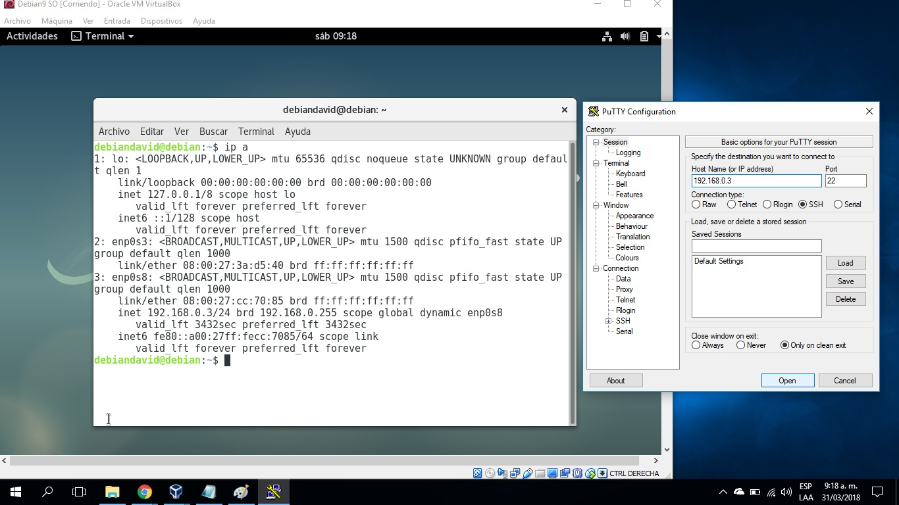
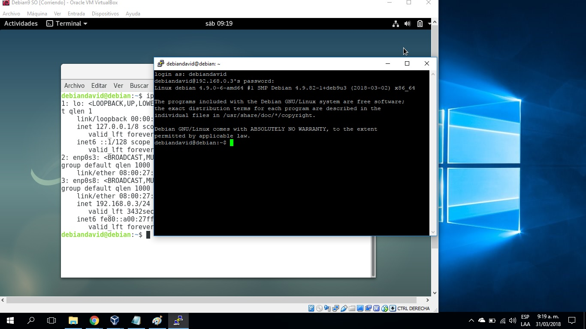

# Primer Parcial

**Nombre:** David Felipe Cobo Plazas

**Código:** A00309844

**Materia:** Sistemas Operativos

**URL repositorio:** https://github.com/davidcobogithub/so-exam1.git
 
_____

# Solución Parcial  

##  1. Descarga y validación del ISO de Debian 9
 
**1.** Descargar la imagen de [Debian 9](https://www.debian.org/).


**2.** Una vez se ha completado la descarga de la imagen, verificamos su MD5 para ver si es la correcta. Utilizamos el programa [MD5 Checksum Utility](https://download.cnet.com/MD5-SHA-Checksum-Utility/3001-2092_4-10911445.html)


 
**3.** Una vez se ha completado la descarga del MD5 Checksum Utility, abrimos el programa y aparecerá como lo muestra la figura:


**4.** Le damos click en el botón Browse, que nos permite buscar la imagen descargada de Debian 9.

**5.** Seleccionamos la imagen y damos abrir, como lo muestra la figura:


**6.** Ahora vamos a ir a la siguiente URL [Debian Checksum](https://cdimage.debian.org/debian-cd/9.4.0/amd64/bt-cd/) que contiene los archivos MD5, SHA-1, SHA-256 y SHA-512 que servirán para verificar la descarga de la imagen de Debian 9.

**7.** Bajamos, buscamos y seleccionamos el archivo SHA512SUMS, como lo muestra la figura:


**8.** Luego,copiamos el Checksum que corresponde a la imagen descargada, como se muestra en la figura:


**9.** Pegamos en el campo de texto que dice Hash  y damos click en el botón Verify.

**10.** Si todo ha quedado bien, aparecerá un mensaje de confirmación exitoso así:


##  2. Instalación de Debian 9 en VirtualBox

**1.** Abrimos el programa VirtualBox.

**2.** Le damos damos click en el botón Nueva para crear una nueva maquina virtual.

**3.** En el campo de texto Nombre basta solo con escribir Debian y automáticamente el campo Tipo cambiará a Linux y el campo Versión cambiará a Debian(64-bit).

**4.** Damos click en el botón Next y configuramos el tamaño de memoria y el tipo de disco duro que desee y que sea compatible con los recursos de hardware.

**5.** Una vez ha finalizado, damos click derecho sobre la maquina virtual de Debian creada y damos click en la opción Configuración... 

**6.** En la opción Sistema, en el campo Orden de arranque arrastramos el item Disco Duro hacia arriba con el fin de dejarlo de primero en el orden de arranque.

**7.** Luego, en la opción Almacenamiento, Panel de Dispositivos de almacenamiento, nos ubicamos en el item Controlador, damos click en el ícono Agregar una unidad óptica y seleccionamos el disco verificado anteriormente.

**8.** Una vez terminamos de configurar la maquina virtual, la seleccionamos y le damos click en el botón Iniciar.

**9.** Una vez iniciada la máquina, seleccionamos Graphical Install.

**10.** Seleccionamos el idioma, la ubicación y la configuración de teclado deseada. Posteriormente, se procederá a instalar los componentes y a configurar la red.

**11.** Procedemos a la configuración de la red (nombre de la máquina y el dominio) y la configuración de usuario (contraseña de root y si queremos crear un nuevo usuario con su contraseña).

**12.** Asignamos un nombre a la máquina. Por ejemplo, Debian.

**13.** Se indica un nombre para el equipo e identificar el dominio al que quieres que pertenezca este equipo, en mi caso escribí local.

**14.** Ahora, configuramos la partición de discos: utilizamos el modo guiado, seleccionamos el disco a usar Debian9, seleccionamos la opción Todos los ficheros en una partición y finalizamos el particionado del disco confirmando los cambios.

**15.** En este paso comenzará la instalación del sistema base y luego procedemos a configurar el gestor de paquetes, seleccionando la región y el servidor ftp a utilizar, en este caso debian.uniminuto.edu.

**16.** Luego nos preguntará si deseamos analizar otro CD o DVD, aquí seleccionamos la opción NO, debido a que se hará la instalación por red.

**17.** Luego nos aparece la configuración del proxy, que en este caso lo dejamos en blanco y damos click en el botón Continuar.

**18.** También nos preguntará si deseamos participar en la encuesta sobre el uso de paquetes, aquí yo seleccioné la opción NO.

**19.** Ahora, seleccionamos los paquetes a instalar, en este caso eligiremos: GNOME, Servidor de impresión, SSH server, Utilidades estándar del sistema, Entorno de escritorio y Servidor Web. 

**20.** Comenzará la descarga e instalación de los paquetes seleccionados.

**21.** Una vez descargados los paquetes previamente seleccionados, nos pedirá instalar GRUB, que es el gestor de boot de linux. Aceptamos su instalación y seleccionamos el Disco Duro en mi caso /dev/sda.

**22.** Seguirá la instalación final del sistema y finalmente deberá aparecer un mensaje de Instalación completada, como lo muestra la figura:  


**23.** Damos click en le botón Continuar y la máquina virtual se reiniciará.

**24.** Una vez reiniciada la máquina, ingresamos con nuestro usuario y password al sistema.

## Información del Sistema Operativo Debian 9.

**1.** Una vez se ha iniciado la sesión, abrimos la consola Terminal del sistema.

**2.** Para obtener la información del sistema operativo, usamos los siguientes comandos: 
```
cat /proc/version

Linux version 4.9.0-6-amd64 (debian-kernel@lists.debian.org) (gcc version 6.3.0 20170516 (Debian 6.3.0-18+deb9u1) ) #1 SMP Debian 4.9.82-1+deb9u3 (2018-03-02)
```
```
lsb_release -a

No LSB modules are available.

Distributor ID:	Debian

Description:	Debian GNU/Linux 9.4 (stretch)

Release:	9.4

Codename:	stretch
```
```
uname -a

Linux debian 4.9.0-6-amd64 #1 SMP Debian 4.9.82-1+deb9u3 (2018-03-02) x86_64 GNU/Linux
```

**3.** Adjunto imagen de comandos en Terminal:


##  3. Configuración de red para la conexión a través de Putty

**1.** Apagamos la máquina virtual para poder acceder a sus configuraciones desde VirtualBox.

**2.** Una vez apagada, damos click derecho sobre la máquina de Debian creada y damos click en la opción Configuración. 

**3.** Luego vamos a la opción Red y en la pestaña Adaptador 2 damos click en checkbox Habilitar adaptador de red.

**4.** Se nos habilitan las opciones de Conectado a y Nombre. En el primero damos click en Adaptador Puente y en el segundo, damos click en el de nuestra preferencia.

**5.** Debe quedar la conexión de red en el Adaptador 2, como se muestra en la figura:


**6.** Damos aceptar y podemos iniciar de nuevo la máquina virtual con las nuevas configuraciones de red.

**7.** De nuevo, iniciamos sesión y abrimos la consola Terminal del sistema.

**8.** En la consola escribimos el comando ip a para ver la información de las interfaces de red que tiene actualmente la máquina.

**9.** Nos aparecerán las interfaces de red y la que permitirá la conexión con Putty(Windows) será la ``` 3: enp0s8 con la dirección ip 192.168.0.3``` como se muestra en la figura:


**10.** Ahora, abrimos el programa Putty para hacer nuestra conexión SSH con la máquina virtual. Si no tiene Putty, puede descargarlo en el siguiente [enlace](https://www.putty.org/).

**11.** Una vez se ha abierto Putty, en el campo Host Name (or IP address), escribimos la dirección IP de la interfaz enp0s8, que en mi caso es la 192.168.0.3 y en el campo Port colocamos el 22.

**12.** Nuestra conexión será del tipo SSH y finalmente damos click en el botón Open para iniciar la conexión. Deberá quedar nuestra configuración como se muestra en la figura: 



**13.** Si todo ha salido sin errores, aparecerá una ventana solicitando el usuario y contraseña para ingresar a la máquina.

**14.** Una vez hemos ingresado e iniciado sesión, se mostrará la siguiente información: 



**15.** Y listo, ya nos hemos conectado a nuestra máquina virtual por SSH mediante la herramienta Putty para Windows.

##  4. Instalación de Git y Tig

**1.** Para instalar git y tig debemos estar en la sesión de administrador o superusuario root.

**2.** Luego, escribimos el siguiente comando ```apt-get install git -y```

**3.** Comenzará la instalación de Git. Al finalizar deberá quedar registro como lo muestra la figura: 


**4.** Podemos verificar la version de Git utilizando el comando ```git --version``` . Aparecerá la siguiente informacion:


**5.** Similarmente, para instalar Tig escribimos el siguiente comando ```apt-get install tig -y```

**6.** Comenzará la instalación de Tig.

**7.** Podemos verificar la version de Tig utilizando el comando ```tig --version``` . Aparecerá la siguiente informacion:


**8.** Para clonar nuestro repositorio debemos dirirnos a la carpeta donde lo queremos poner. En mi caso, lo puse en mi carpeta personal del sistema.

**9.** Estando sobre la carpeta deseada, escribimos el siguiente comando para clonar nuestro repositorio. En mi caso es, git clone https://github.com/davidcobogithub/so-exam1.git

**10.** Luego de que se ha completado la clonación del repositorio, accedemos a la carpeta so-exam1, con el comando ```cd so-exam1/```

**11.** Estando dentro de la carpeta so-exam1, escribimos el comando tig, para ver el historial de commits hechos hasta el momento

**12.** Debería mostrarse la siguiente información:


**13.** De esa forma ya nos aseguramos de tener instalados Git y Tig correctamente.

##  5. Exportación e importación de la máquina virtual

**1.** Con la máquina apagada, vamos al VitualBox y seleccionamos la pestaña Archivo.

**2.** Buscamos la opción Exportar servicio virtualizado... Como lo muestra la figura:


**3.** Luego, seleccionamos el nombre de la máquina virtual que queremos exportar. En mi caso se llama Debian9 SO y damos click en el botón Next.

**4.** Nos aparecerán el campo Archivo y allí ponemos la ruta en la que queremos que quede exportada la máquina virtual. Debe quedar como lo muestra la figura y damos click en el botón Next.


**5.** Luego de nuevo damos click en el botón Next e inmediatamente comenzará el proceso de exportación como lo muestra la figura: 


**6.** Esperamos a que termine el proceso de exportación de la máquina y listo ya tenemos nuestra máquina exportada.

##  6. Importación de la máquina virtual

**1.** Vamos al VitualBox y seleccionamos la pestaña Archivo.

**2.** Buscamos la opción Importar servicio virtualizado... Como lo muestra la figura: 


**3.** Luego, seleccionamos el nombre de la máquina virtual que queremos importar. En mi caso se llama Debian9 SO y damos click en el botón Next.Debe quedar como lo muestra la figura: 


**4.** Nos aparecerán las preferencias del servicio de importación de la máquina. Una vez hemos configurado nuestra máquina virtual a importar, le damos click al botón Importar como lo muestra la figura: 


**5.** Esperamos a que termine el proceso de importación de la máquina y listo ya tenemos nuestra máquina para ser utilizada.
